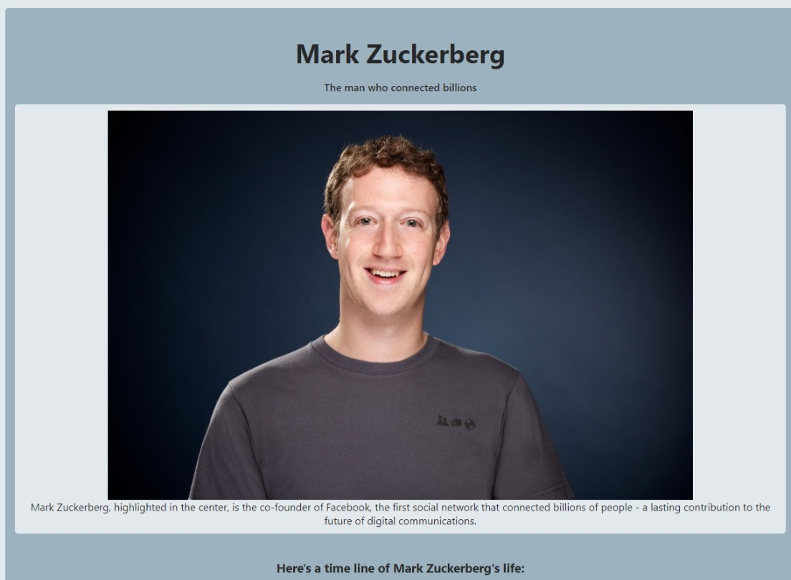

# Tribute Page of Mack Zuckerberg

> This page is based on a Free Code Camp project about responsive web design, specifically the survey form project. I decided to make my tribute page about Mack Zuckerberg, with a brief timeline explaining his beginnings to what he has achieved today. Also, being a Free Code Camp project, the methods, tags, properties, among others, required to finish the page were used.

Additional description about the project and its features.

## Built With

- Major languages: HTML, CSS.
- Technologies used: Linux, Git bash.

## Live Demo

[Live Demo Link](https://vxnec0de.github.io/tribute_page/)

## Getting Started

**Clone the repository in Git and run it from a browser.**

## Authors

👤 **Vanessa Carolina Rubio Cheing**

- GitHub: [@VxneC0de](https://github.com/VxneC0de)
- Instagram: [@v_rc20](https://www.instagram.com/v_rc20/)
- LinkedIn: [LinkedIn](https://www.linkedin.com/in/vanessa-rubio-7b7492293/)

## 🤝 Contributing

Contributions, issues, and feature requests are welcome!

Feel free to check the [issues page](https://github.com/VxneC0de/tribute_page/issues).

## Show your support

Give a ⭐️ if you like this project!

## Acknowledgments

- Hat tip to anyone whose code was used: I thank Google for the Information acquired for this project and Microsoft Edge for the images.
- Inspiration: https://es.wikipedia.org/wiki/Mark_Zuckerberg

## 📝 License

This project is [CC0 1.0 Universal](LICENSE) licensed.